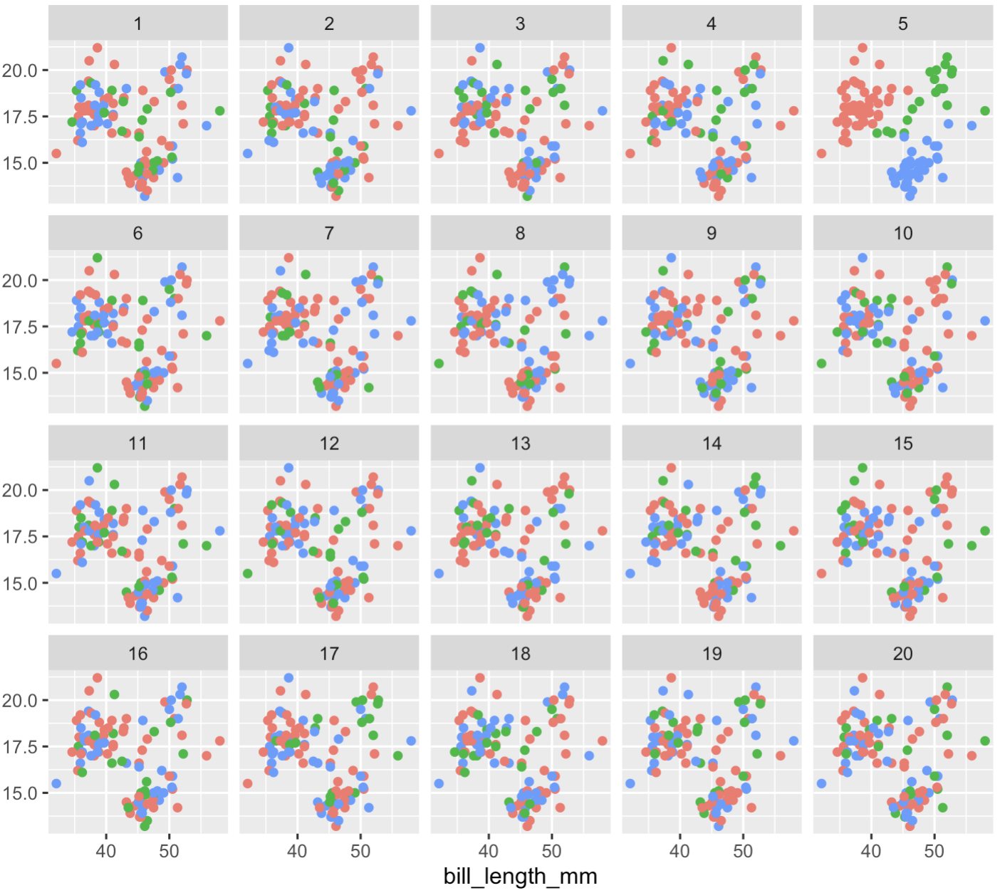
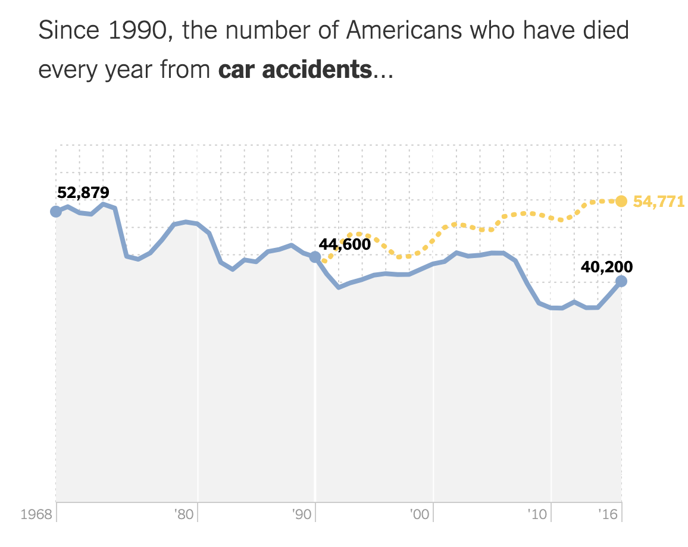
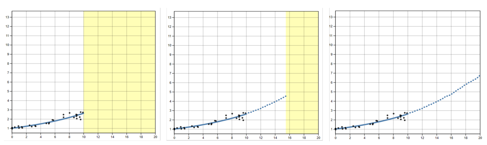
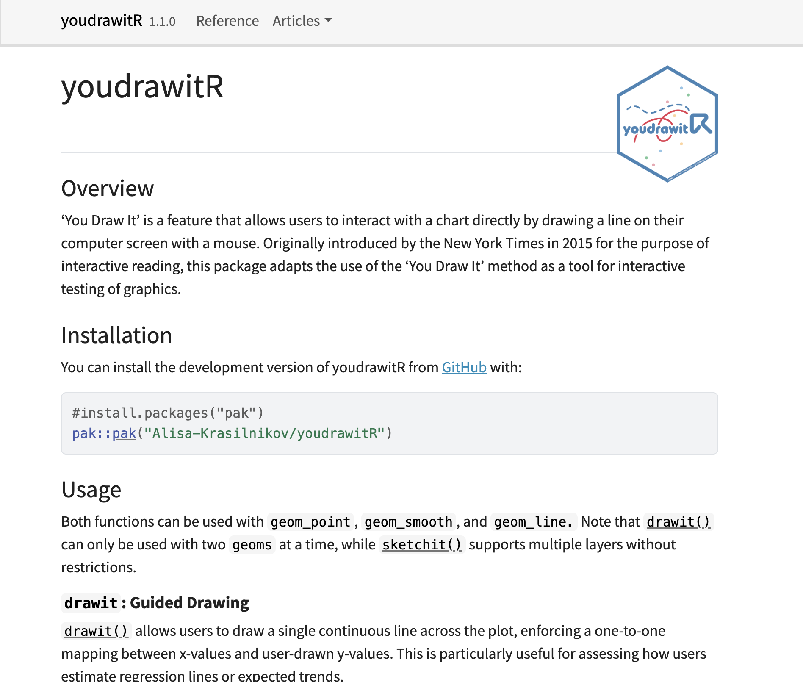
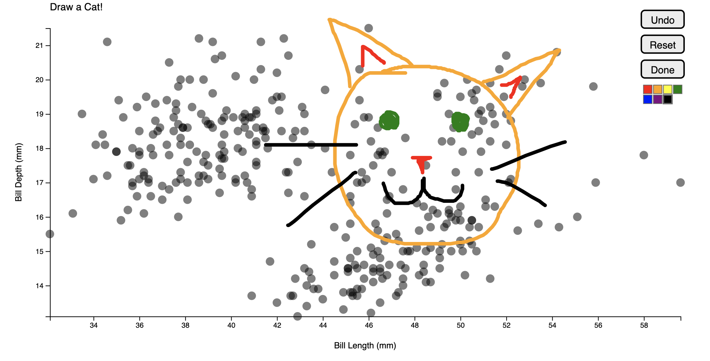
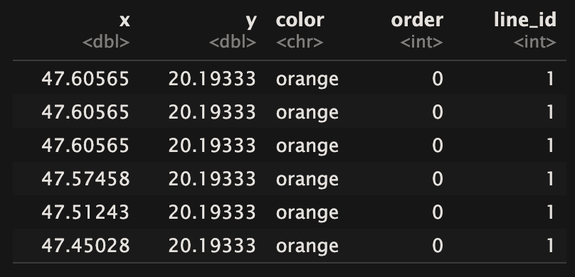
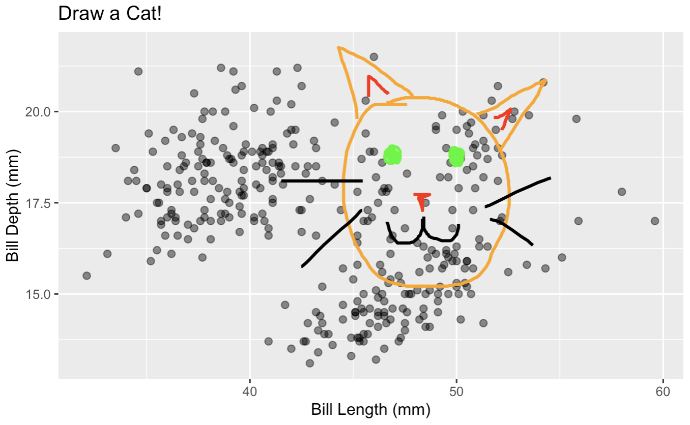
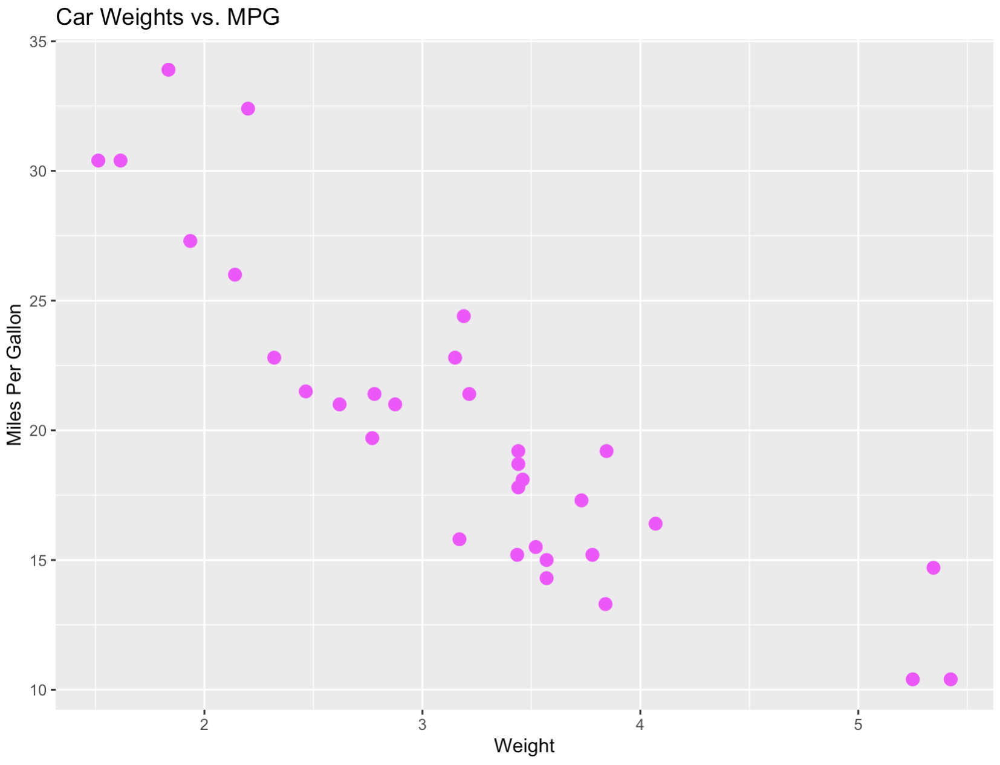
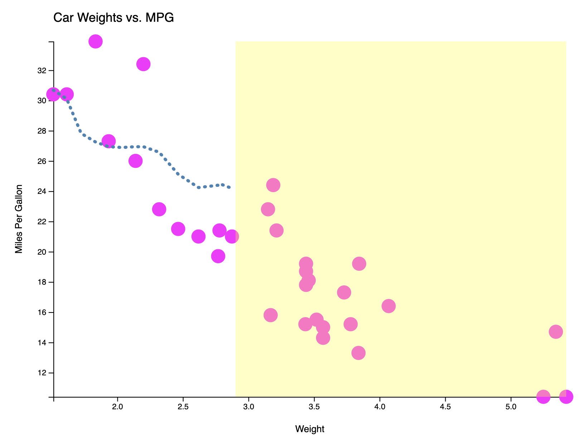
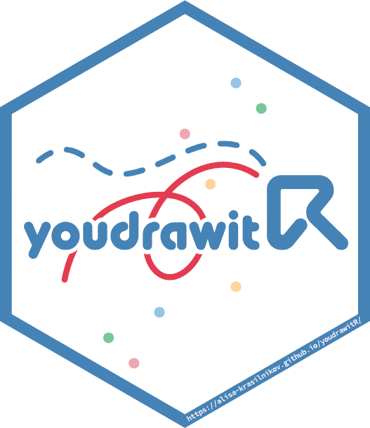

```{r setup, include=FALSE}
library(tidyverse)
library(palmerpenguins)
library(pak)
library(youdrawitR)
```

```{js echo=FALSE}
//| echo: false
//| include: false
Reveal.on('slidechanged', function(event) {
  var widgets = event.previousSlide ? event.previousSlide.querySelectorAll('.html-widget') : [];
  widgets.forEach(function(w) {
    w.style.height = '';
    w.style.width = '';
  });
});
```

## Graphs are Statistical Tools

- Visualization turns raw data into accessible narratives
- Graphs and charts are everywhere
  - Statistical charts are a central way people engage with data

  
## How do people actually read graphs?

- Decisions made "by eye" [@robinson2023_eye_fitting]
  - COVID-19 graphs [@schneider2024crisis]
- Important to convey information correctly
- Different designs can lead to different interpretations 

## Graphical testing

- `Explicit` and `implicit` [@Vanderplas2020]
  - **Explicit:** Answer specific questions about a graph
  - **Implicit:** Have the user infer the question
- Statistical lineups – `nullabor` package [@nullabor]


{fig-align="center"}

## The "You Draw It" Idea
:::: {.columns}
::: {.column width="50%"}
- Introduced by the **New York Times**
- Show viewers part of a trend + ask them to **draw the rest** [@katz2017you_draw_it]
- Reveals assumptions, biases, and engagement in a way passive charts cannot
:::
::: {.column width="50%"}

:::
::::

## `youdrawitR` for Graphical Testing

- Originally modified by Dr. Emily Robinson
  - Testing perception of log vs. linear scales [@Robinson2022_dissertation]
  - Designed to render within Shiny to receive user input
- Built as an R package by Dillon Murphy

{fig-align="center"}

## The Problem with the Old `youdrawitR`

- Not accessible to broader R community of graphics researchers
- Not easily extensible to new plot types + other aesthetic features

## The new `youdrawitR`



## **Solution:** A `ggplot2`-Native Interface

```r
library(youdrawitR)

(ggplot(data = mtcars, aes(x = wt, y = mpg)) +
  geom_point() +
  labs(x = "Weight", y = "Miles Per Gallon")) |> 
drawit()
```
- Pass a `ggplot2` object directly into `drawit()` or `sketchit()`
- No JavaScript required
- Interactivity as a **layer**, just like a geom or theme

The statistical visualization community works in **`ggplot2`**, so why should interactive testing be any different?

## r2d3 
[@r2d3]

```r
  youdrawit_plot <- r2d3(
    data = payload,
    script = system.file("d3/multiLayer.js", package = "youdrawitR"),
    dependencies = deps,
    options = options,
    width = width,
    height = height
  )
```

- Takes in data from R
- Passes through JavaScript D3 file
- Outputs htmlwidget

## Restructuring of `youdrawitR`

{fig-align="center"}

## Restructuring of `youdrawitR`
:::: {.columns}
::: {.column width="50%"}

:::

::: {.column width="50%" style="font-size: 0.5em;"}
```js
// Layer render loop 
(data.layers || []).forEach(layer => {

  const rendererName = "render" + capitalize(layer.geom_type) + "Layer";
  const renderer = window[rendererName];

  if (typeof renderer !== "function") return;
  
  ...
  
  renderer(svg, plot, layer);
});

...

// Attach drawit if called
if (options?.drawit && window.youdrawitAttachDrawit) {
  window.youdrawitAttachDrawit(
    svg,
    width,
    height,
    data.layers?.[0]?.data,
    options
  );
}
...
```
:::
::::

## Restructuring of `youdrawitR`

{fig-align="center"}

## `drawit()`: Structured Prediction

- User draws a predicted trend across a **highlighted region**
- Designed for **one-to-one** x-y matching
- Useful for: regressions, forecasting tasks, reveals of true trend

::: {style="height: 350px; width: 500px; overflow: hidden; position: relative;"}
```{r}
#| echo: false
(ggplot(data = penguins, aes(x = bill_length_mm, y = bill_depth_mm)) +
  geom_point() +
  geom_smooth(method = "lm") +
  labs(x = "Bill Length (mm)", y = "Bill Depth (mm)")) |>
  drawit(height = 300, width = 400, smoother = 2, show_on_finish = TRUE)
```
:::

## `drawit()`: Key Parameters

| Argument | Purpose |
|---|---|
| `draw_start` | Where drawing begins on the x-axis |
| `show_on_finish` | Reveals the true line after drawing |
| `smoother` | Reduces jitter in the drawn path |
| `interpolator` | Controls density of intermediate points |

## `sketchit()`: Freeform Drawing

- No one-to-one data matching required
- Users can draw **multiple lines**
- Consistent experience regardless of data density

::: {style="height: 350px; width: 500px; overflow: hidden; position: relative;"}
```{r}
#| echo: false
(ggplot(data = penguins, aes(x = bill_length_mm, y = bill_depth_mm)) +
  geom_point() +
  labs(x = "Bill Length (mm)", y = "Bill_Depth (mm)"))  |>
  sketchit(height = 300, width = 400)
```
:::

## `sketchit()`: Key Parameters

| Argument | Purpose |
|---|---|
| `palette` | Set of colors available for drawing |
| `starting_color` | Initial drawing color |
| `button_position` | Position of control interface (to avoid overlapping data) |
| `min_lines` / `max_lines` | Controls the number of lines the user can draw|


## Shiny Integration

Both functions work inside Shiny apps and return user-drawn data as a reactive tibble:

```r
res <- drawit(p, shiny_message_loc = "my_input")

# res$youdrawit_plot -> the widget
# res$points() -> reactive tibble of drawn (x, y) values
```

Captured data aligns with original x-values, ready for **merging and analysis**.

::: {layout-ncol=3}





:::

## The Bigger Picture: An Interactive Grammar

`youdrawitR` treats interactivity as a **grammatical layer**
added to a plot just as easily as a geom or theme.

This lowers the barrier and keeps researchers within familiar `ggplot2` syntax.

::: {layout-ncol=2}
{style="height:300px; width:auto;"}

{style="height:300px; width:auto;"}
:::

## Usability Testing

- Recruited 10 participants
  - Familiar with `ggplot2`
  - Backgrounds primarily in graphical testing and education
  
- Thinkaloud + Semi-structured interview
- User vs. **Implementer**

## Usability Testing

- People found it easy to use and intuitive
- Had reasons to use it 
- Wanted some features: 
  - Exporting with drawing
  - Data tracking in non-Shiny environment

## What's Next

- Extend geometry: bar charts, histograms, boxplots, etc. 
  - Particularly interested in maps
- **Python support** via `plotnine` integration
- CRAN release

## Thank You!

:::: {.columns}
::: {.column width="30%"}
{width=200px}
:::
::: {.column width="70%"}
Email:
  `alisa.krass@gmail.com`
Documentation: 
  `https://alisa-krasilnikov.github.io/youdrawitR/`

*Questions?*
:::
::::

## References 
::: {style="font-size: 0.7em;"}
::: {#refs}
:::
:::