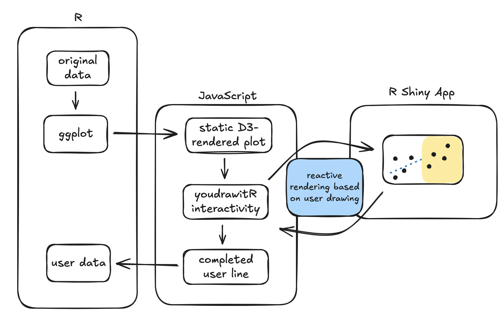
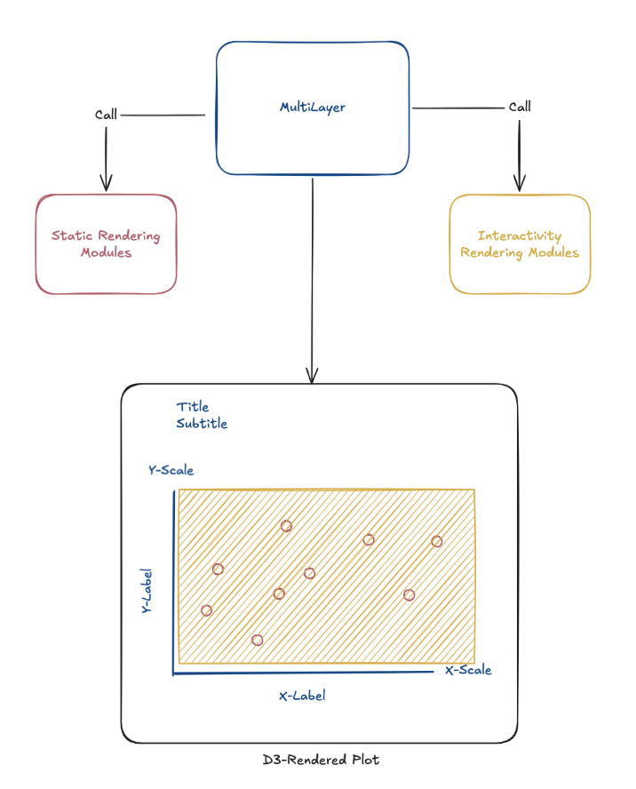
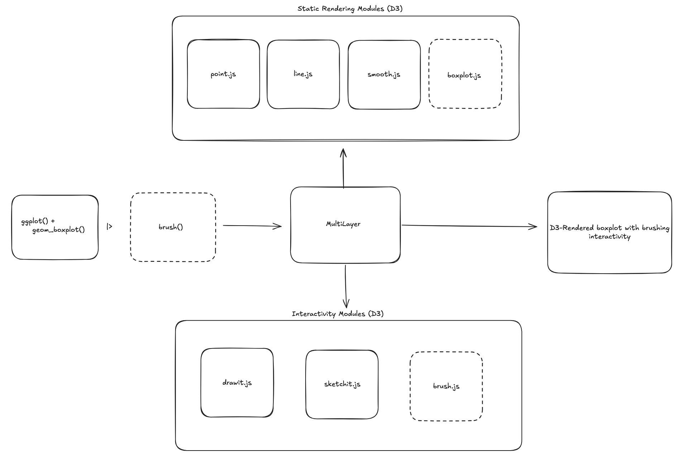

```{r setup, include=FALSE}
library(tidyverse)
library(palmerpenguins)
library(pak)
library(youdrawitR)
```

```{js echo=FALSE}
//| echo: false
//| include: false
Reveal.on('slidechanged', function(event) {
  var widgets = event.previousSlide ? event.previousSlide.querySelectorAll('.html-widget') : [];
  widgets.forEach(function(w) {
    w.style.height = '';
    w.style.width = '';
  });
});
```

## How do people actually read graphs?

- Visualization turns raw data into accessible narratives
- But **how accurately** do people interpret what they see?
- Research shows judgments like "fitting a line by eye" are:
  - Systematically **biased**
  - Yet remarkably **consistent** across individuals

## The "You Draw It" Idea

- Introduced by the **New York Times** in 2015
- Show viewers part of a trend + ask them to **draw the rest**
- Reveals assumptions, biases, and engagement in a way passive charts cannot

> *What if we could bring this into R?*

## youdrawitR as a Graphical Testing Tool

- Originally created by Dr. Emily Robinson
  - Designed to render within Shiny to receive user input
- Built as an R package by Dillon Murphy

## The Problem with the Old `youdrawitR`

- Required knowledge of **JavaScript and D3**
- Not accessible to the broader R community
- Not easily extensible to new plot types + other aesthetic features

The statistical visualization community works in **`ggplot2`**, so why should interactive testing be any different?

## Our Solution: A ggplot2-Native Interface

```r
(ggplot(data = mtcars, aes(x = wt, y = mpg)) +
  geom_point() +
  labs(x = "Weight", y = "Miles Per Gallon")) |> 
drawit()
```
- Pass a `ggplot2` object directly into `drawit()` or `sketchit()`
- No JavaScript required
- Interactivity as a **layer**, just like a geom or theme

## Restructuring of `youdrawitR`



## Restructuring of `youdrawitR`

{fig-align="center"}

---

## Restructuring of `youdrawitR`

{fig-align="center"}

## `drawit()`: Structured Prediction

- User draws a predicted trend across a **highlighted region**
- Designed for **one-to-one** x-y matching
- Useful for: forecasting tasks, graphical testing, education

::: {style="height: 350px; width: 500px; overflow: hidden; position: relative;"}
```{r}
#| echo: false
(ggplot(data = mtcars, aes(x = wt, y = mpg)) +
  geom_point() +
  geom_smooth(method = "lm") +
  labs(x = "Weight", y = "Miles Per Gallon")) |>
  drawit(height = 300, width = 400, smoother = 0.5, show_on_finish = TRUE)
```
:::

## `drawit()`: Key Parameters

| Argument | Purpose |
|---|---|
| `draw_start` | Where drawing begins on the x-axis |
| `show_on_finish` | Reveals the true line after drawing |
| `smoother` | Reduces jitter in the drawn path |
| `interpolator` | Controls density of intermediate points |

## `sketchit()`: Freeform Drawing

- No one-to-one data matching required
- Users can draw **multiple lines**
- Consistent experience regardless of data density

::: {style="height: 350px; width: 500px; overflow: hidden; position: relative;"}
```{r}
#| echo: false
(ggplot(data = mtcars, aes(x = wt, y = mpg)) +
  geom_point() +
  labs(x = "Weight", y = "Miles Per Gallon")) |>
  sketchit(height = 300, width = 400)
```
:::

## `sketchit()`: Key Parameters

| Argument | Purpose |
|---|---|
| `palette` | Set of colors available for drawing |
| `starting_color` | Initial drawing color |
| `button_position` | Position of control interface (to avoid overlapping data) |
| `min_lines` / `max_lines` | Controls the number of lines the user can draw|


## Shiny Integration

Both functions work inside Shiny apps and return user-drawn data as a reactive tibble:

```r
res <- drawit(p, shiny_message_loc = "my_input")

# res$youdrawit_plot -> the widget
# res$points() -> reactive tibble of drawn (x, y) values
```

Captured data aligns with original x-values, ready for **merging and analysis**.

## The Bigger Picture: An Interactive Grammar

`youdrawitR` treats interactivity as a **grammatical layer**
added to a plot just as easily as a geom or theme.

This lowers the barrier and keeps researchers within familiar `ggplot2` syntax.

## What's Next

- Extend beyond scatterplots bar charts, histograms, line charts
- **Python support** via `plotnine` integration
- CRAN release

## Thank You!

*Questions?*