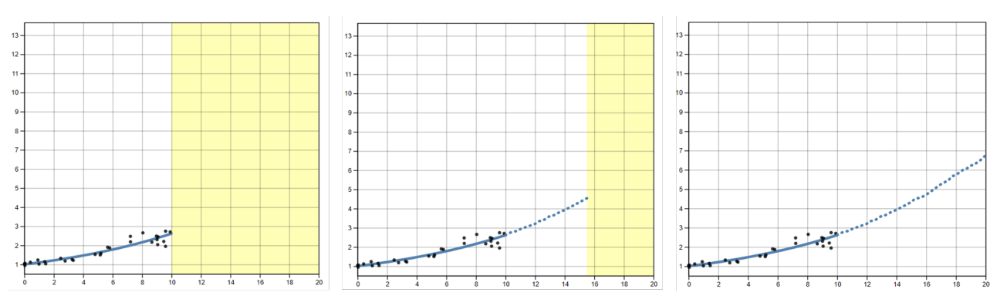
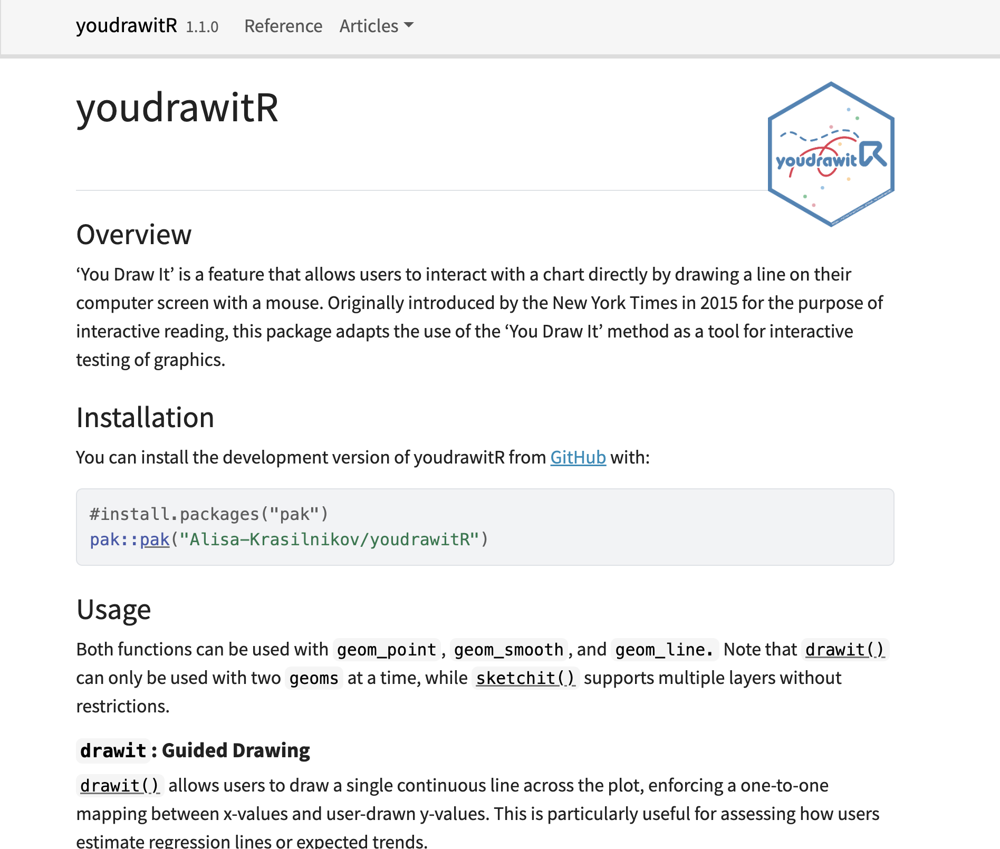
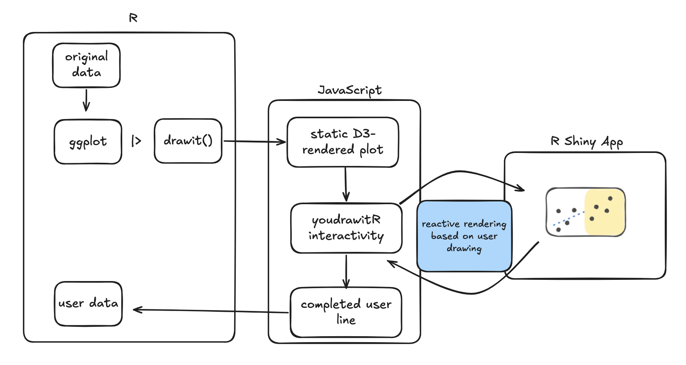
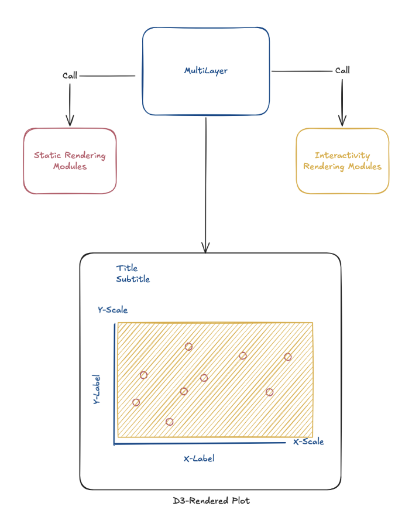
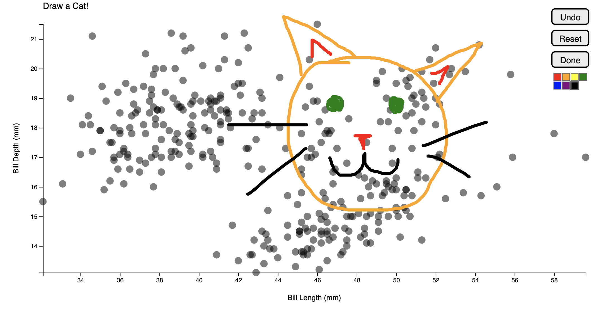
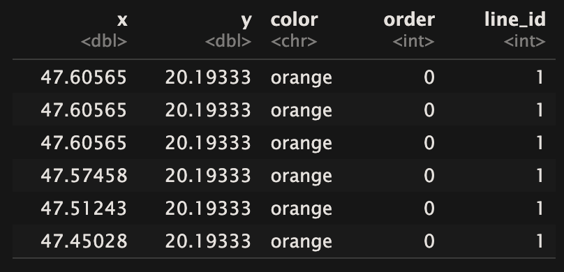
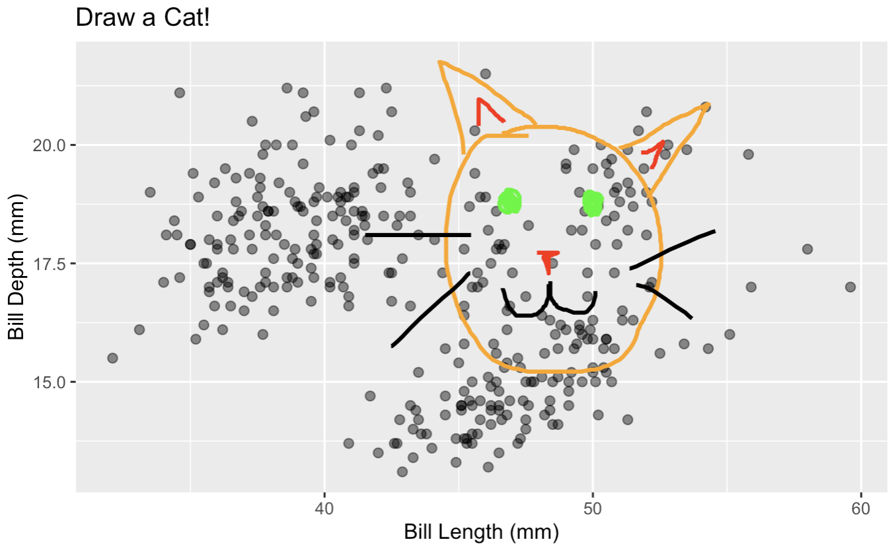
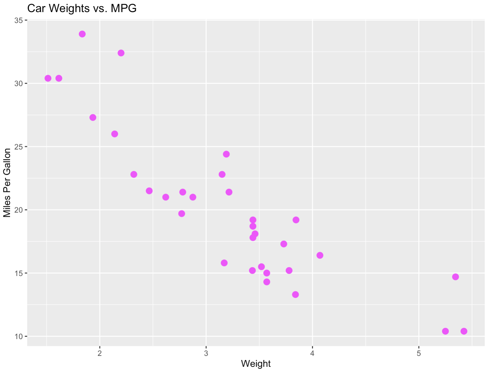
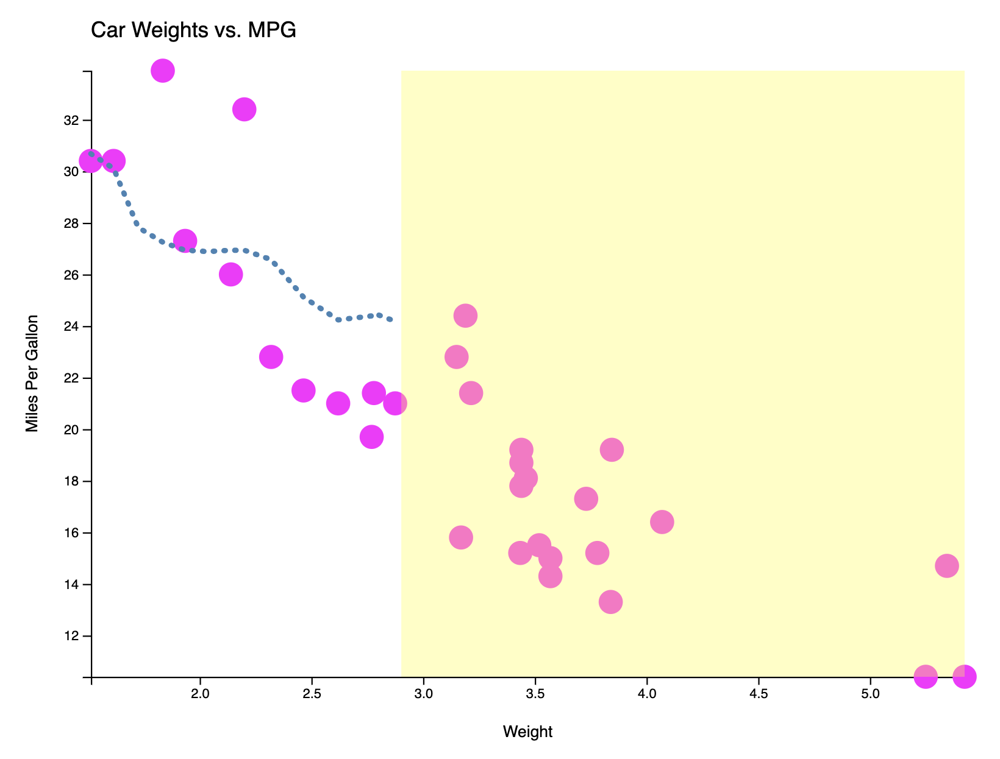
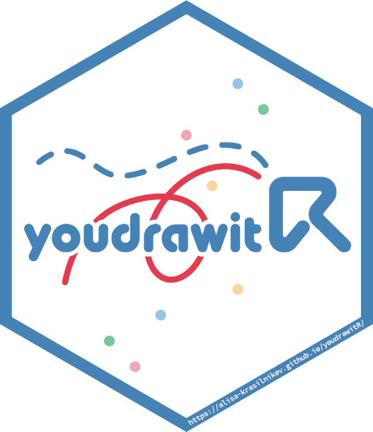

```{r setup, include=FALSE}
library(tidyverse)
library(palmerpenguins)
library(pak)
library(youdrawitR)
```

```{js echo=FALSE}
//| echo: false
//| include: false
Reveal.on('slidechanged', function(event) {
  var widgets = event.previousSlide ? event.previousSlide.querySelectorAll('.html-widget') : [];
  widgets.forEach(function(w) {
    w.style.height = '';
    w.style.width = '';
  });
});
```

## Graphs are Statistical Tools

::: columns
::: {.column width="45%"}
- Visualization turns raw data into accessible narratives [@schneider2024crisis]
- People make decisions by looking at charts [@padilla2018decision]
  - Statistical charts are a central way people engage with data
:::

::: {.column width="55%"}

{width=100% fig-align="center" style="margin-left: 40px;"}
:::
:::

## Graphical Testing

:::: columns
::: {.column width=50%}
- Important to ensure information is conveyed correctly
- Certain charts are more accurate than others [@cleveland1984]
- Does not necessarily align with statistical intuition [@mosteller1981eye]
:::

::: {.column width=50%}
:::{style="text-align: center;"}
![Early graphical testing from Cleveland and McGill [-@cleveland1984] showing similar segments (ex. B and C) are easier to distinguish in barplots](images/pievsbar.png)
:::
:::
:::: 

## Modern Graphical Testing
 
:::: columns
::: {.column width=60%}
- `Explicit` and `implicit` [@Vanderplas2020]
  - **Explicit:** Answer specific questions about a graph
  - **Implicit:** Have the user infer the question
- Statistical lineups – `nullabor` package [@wickham2018nullabor]
:::
::: {.column width=40%}
![`nullabor` plot displaying true `palmerpenguins` dataset [@palmerpenguins] amongst randomized groupings](images/clusters.png)
:::
::::

## The 'You Draw It' Idea
:::: {.columns}
::: {.column width="50%"}
- **Interactive Graphics** have become more prevalent
- 'You Draw It' introduced by the **New York Times**
- Show viewers part of a trend + ask them to **draw the rest** [@katz2017you_draw_it]
:::
::: {.column width="50%"}
![NYT 'You Draw It' graph, displaying the true trend after the user has completed drawing [@katz2017you_draw_it]](images/NYT Task.png)
:::
::::

## `youdrawitR` for Graphical Testing

- Originally modified by Dr. Emily Robinson
  - Testing perception of log vs. linear scales [-@Robinson2022_dissertation]
  - Designed to render within Shiny to receive user input
- Built as an R package by Dillon Murphy et al. [-@youdrawitR0]

{fig-align="center"}

## The Problem with the Old `youdrawitR`

- Not accessible to broader R community of graphics researchers
- Not easily extensible to new plot types + other aesthetic features

## The new `youdrawitR`

```{r}
#| fig-align: center

```


<!-- ## {background-image="images/youdrawitR documentation.png"} -->

## **Solution:** A `ggplot2`-Native Interface

```r
library(youdrawitR)

(ggplot(data = mtcars, aes(x = wt, y = mpg)) +
  geom_point() +
  labs(x = "Weight", y = "Miles Per Gallon")) |> 
drawit()
```
- Pass a `ggplot2` object directly into `drawit()` or `sketchit()`
- No JavaScript required
- Interactivity as a **layer**, just like a geom or theme

The statistical visualization community works in **`ggplot2`**, so why should interactive testing be any different?

## `r2d3`
[@r2d3]

```r
  youdrawit_plot <- r2d3(
    data = payload,
    script = system.file("d3/multiLayer.js", package = "youdrawitR"),
    dependencies = deps,
    options = options,
    width = width,
    height = height
  )
```

- Takes in data from R
- Passes through JavaScript D3 file
- Outputs htmlwidget

## Restructuring of `youdrawitR`

{fig-align="center"}

## Restructuring of `youdrawitR`
:::: {.columns}
::: {.column width="50%"}

:::

::: {.column width="50%" style="font-size: 0.5em;"}
```js
// Layer render loop 
(data.layers || []).forEach(layer => {

  const rendererName = "render" + capitalize(layer.geom_type) + "Layer";
  const renderer = window[rendererName];

  if (typeof renderer !== "function") return;
  
  ...
  
  renderer(svg, plot, layer);
});

...

// Attach drawit if called
if (options?.drawit && window.youdrawitAttachDrawit) {
  window.youdrawitAttachDrawit(
    svg,
    width,
    height,
    data.layers?.[0]?.data,
    options
  );
}
...
```
:::
::::

## Restructuring of `youdrawitR`

{fig-align="center"}

## `drawit()`: Structured Prediction {.nostretch}

:::: columns
::: {.column width=50%}
- User draws a predicted trend across a **highlighted region**
- Designed for **one-to-one** x-y matching
- Useful for: regressions, forecasting tasks, reveals of true trend
:::

::: {.column width=50%}
::: {.widgetbox}
::: {.widgetscale}
```{r}
#| echo: false

(ggplot(data = penguins, aes(x = bill_length_mm, y = bill_depth_mm)) + 
  geom_point(alpha = 0.5) +
  geom_smooth(method = "lm") +
  labs(x = "Bill Length (mm)", y = "Bill Depth (mm)")) |>
  drawit(
    smoother = 2,
    show_on_finish = TRUE
  )
```
:::
:::
:::
::::


## `drawit()`: Key Parameters

::: {style="font-size: 0.75em; width: 100%;"}
| Argument | Purpose |
|---|---|
| `draw_start` &nbsp;&nbsp;&nbsp;&nbsp;&nbsp;&nbsp;&nbsp;&nbsp;&nbsp;&nbsp;&nbsp;&nbsp;&nbsp;&nbsp;&nbsp;&nbsp;&nbsp;&nbsp;&nbsp;&nbsp;&nbsp;&nbsp;&nbsp;&nbsp;&nbsp;&nbsp;&nbsp;&nbsp;&nbsp;&nbsp;&nbsp;&nbsp;&nbsp; | Where drawing begins on the x-axis |
| `show_on_finish`     | Reveals secondary geometry|
| `smoother` | Controls point binning in draw space|
| `interpolator` | Controls density of intermediate points |
:::

::: {layout-ncol=2}
{style="height:300px; width:auto;"}

{style="height:300px; width:auto;"}
:::

## `sketchit()`: Freeform Drawing {.nostretch}

:::: columns
::: {.column width=50%}
- No one-to-one data matching required
- Users can draw **multiple lines**
- Useful for: clusters, point detection
:::

::: {.column width=50%}
::: {.widgetbox}
::: {.widgetscale}
```{r}
#| echo: false
(ggplot(data = penguins, aes(x = bill_length_mm, y = bill_depth_mm,
                             colour = species)) +
  geom_point() +
  labs(x = "Bill Length (mm)", y = "Bill Depth (mm)"))  |>
  sketchit()
```
:::
:::
:::
::::


## `sketchit()`: Key Parameters

::: {style="font-size: 0.75em; width: 100%;"}
| Argument | Purpose |
|---|---|
| `palette` | Set of colors available for drawing |
| `starting_color` | Initial drawing color |
| `button_position` | Position of control interface |
| `min_lines` / `max_lines` | Controls the number of lines the user can draw|
:::

::: {layout-ncol=2}
{style="height:300px; width:auto;"}

{style="height:300px; width:auto;"}
:::

## Shiny Integration

Both functions work inside Shiny apps and return user-drawn data as a reactive tibble:

```r
res <- drawit(p, shiny_message_loc = "my_input")

# res$youdrawit_plot -> the widget
# res$points() -> reactive tibble of drawn (x, y) values
```

Captured data aligns with original x-values, ready for **merging and analysis**.

::: {layout-ncol=3}





:::

## The Bigger Picture: An Interactive Grammar

`youdrawitR` treats interactivity as a **grammatical layer**
that can ba tacked onto a plot.

This lowers the barrier and keeps researchers within familiar `ggplot2` syntax.

::: {layout-ncol=2}
{style="height:300px; width:auto;"}

{style="height:300px; width:auto;"}
:::

## Usability Testing
:::: columns
::: {.column width="50%"}
- Recruited 9 participants
  - Familiar with `ggplot2`
  - Backgrounds primarily in graphical testing and education
  
- Thinkaloud (25 mins) + Semi-structured interview (5 mins) [@rogers2023datagathering]
- User vs. **Implementer**
:::

::: {.column width="50%" style="font-size: 0.5em; border: 1px solid gray; border-radius: 5px; padding: 10px; box-sizing: border-box;"}
**Interview Questions:**

1. How would you describe your overall experience?
2. Were there any parts of the task you struggled with?
3. Do you see yourself using this tool?
4. What kinds of tasks would you use this for?
5. How does this compare to other available tools?
6. What features would make you more likely to adopt it?
:::
::::

## Usability Testing

:::: {.columns}
::: {.column width="50%"}
- **People found it easy to use and intuitive**
- **Had reasons to use it:**
  - Research 
  - Annotation
  - Education

:::

::: {.column width="50%"}
- **Wanted some features: **
  - Exporting with drawing
  - Data tracking in non-Shiny environment
  - Buttons in `drawit()`

:::

::::

## What's Next

:::: {.columns}
::: {.column width="40%"}
- Extend geometry: bar charts, histograms, boxplots, etc. 
  - Particularly interested in maps
- **Python support** via `plotnine` integration
- CRAN release

:::

::: {.column width="60%"}

:::

::::

## Thank You!

:::: {.columns}
::: {.column width="30%"}
{width=200px}
:::
::: {.column width="70%"}
Email:
  `alisa.krass@gmail.com`
Documentation: 
  `https://alisa-krasilnikov.github.io/youdrawitR/`

*Questions?*
:::
::::

## References {.scrollable}
::: {style="font-size: 0.6em;"}
::: {#refs}
:::
:::